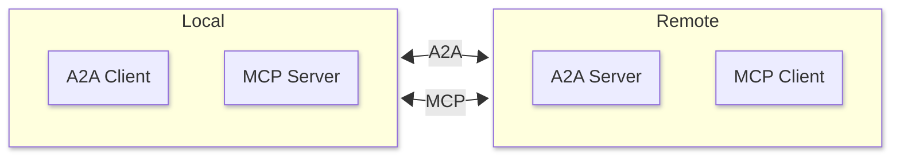

# WebRTC Transport for Model Context Protocol

There are scenarios where neither **STDIO** nor **StreamableHTTP** transport can be used to connect an MCP client to an MCP server. **WebRTC** can often be used instead if there is some sort of signalling connection established between the two parties.

# Example

For example, a remote A2A agent might need to use our local MCP server to access the filesystem on the A2A client's host. The situation is as follows:



The MCP Client on the remote A2A agent can directly connect to our local MCP server over HTTP due to NATs. Also, even if no NATs are involved we would have to ensure it is really the agent who attempts to connect to the server and noone else. 

Instead, the existing A2A connection will act as the signalling connection for WebRTC, it will exchange WebRTC signalling data so that MCP connection can be established.

# Usage

```typescript
  import { McpServer } from "@modelcontextprotocol/sdk/server/mcp.js";
  import { WebRTCServerTransport } from "mcp-webrtc";

  const server = new McpServer({
    name: "example-server",
    version: "1.0.0",
  });
  server.registerTool("greet", {}, () => ({
    content: [{ type: "text", text: "Howdy" }],
  }));
  await server.connect(new WebRTCServerTransport({
    onSignal: async (data) => { 
      // forward data via signalling channel and call peer.signal(data)
    }
  }));
```

```typescript
  import { Client } from "@modelcontextprotocol/sdk/client/index.js";
  import { WebRTCClientTransport } from "mcp-webrtc";

  const client = new Client({
    name: "example-client",
    version: "1.0.0",
  });
  await client.connect(new WebRTCClientTransport({
    onSignal: async (data) => { 
      // forward data via signalling channel and call peer.signal(data)
    }
  }));
```

Proceed by exchange the signalling data via artbitrary connection.