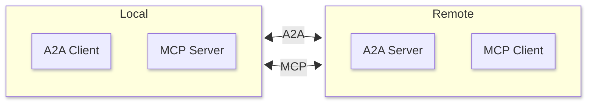

# WebRTC Transport for Model Context Protocol

[The Model Context Protocol (MCP)](https://modelcontextprotocol.io) is an open standard for connecting AI applications to external systems, such as tools and data sources. It defines several transport mechanisms for client-server communication, including STDIO (over standard input/output) and Streamable HTTP (for web-based streaming).

However, there are scenarios—such as in browser environments or firewalled networks—where neither STDIO nor Streamable HTTP can effectively connect an MCP client to an MCP server. In these cases, [WebRTC](https://webrtc.org/) provides a peer-to-peer alternative, leveraging real-time communication capabilities, provided a signaling connection (e.g., via WebSockets or another channel) is established between the parties.

This repository implements a WebRTC-based transport layer compatible with the MCP specification, enabling seamless integration in constrained networking setups.

# Installation

Python:

```bash
pip install mcp-webrtc
```

Typescript:

```bash
npm install mcp-webrtc
```

# Example

For example, a remote A2A agent might need to use our local MCP server to access the filesystem on the A2A client's host. The situation is as follows:



The MCP Client on the remote A2A agent can directly connect to our local MCP server over HTTP due to NATs. Also, even if no NATs are involved we would have to ensure it is really the agent who attempts to connect to the server and noone else. 

Instead, the existing A2A connection will act as the signalling connection for WebRTC, it will exchange WebRTC signalling data so that MCP connection can be established.

# Usage

Server:

```python
    from mcp_webrtc import webrtc_server_transport
    from aiortc.contrib.signaling import TcpSocketSignaling
    from mcp.server.lowlevel import Server
    from mcp.types import Tool

    app = Server("mcp-greeter")

    @app.list_tools()
    async def list_tools() -> list[Tool]:
        return [
            Tool(
                name="greet",
                description="Greets the caller",
                inputSchema={
                    "type": "object",
                    "required": [],
                    "properties": {},
                },
            )
        ]

    async with webrtc_server_transport(TcpSocketSignaling("localhost", 8000)) as (read, write):
        await app.run(
            read, write, app.create_initialization_options()
        )
```

Client:

```python
    from mcp import ClientSession
    from mcp_webrtc import webrtc_client_transport
    from aiortc.contrib.signaling import TcpSocketSignaling

    async with (
        webrtc_client_transport(TcpSocketSignaling("localhost", 8000)) as (
            read,
            write,
        ),
        ClientSession(read, write) as session,
    ):
        await session.initialize()
        result = await session.list_tools()
        print(result.tools)
```
